# Deskline — AI Voice Agents for Hospitality

**Deskline** is a Django platform for managing hospitality voice agents, bookings, call history, and analytics.

Voice runtime is intended to live on **Retell** (or similar). This repo stores agent/config details and ops data in Django — the old Twilio + FastAPI ConversationRelay stack has been removed.

---

## Features

- **Agent management** for front desk & restaurant hosting configs
- **Local booking records** (`book_room` / `book_table` style tools data)
- **Dashboard** — KPIs, today’s reservations, recent calls
- **Call history & analytics** — outcomes, sentiment, agent performance
- **My Tools** — attach tool schemas to agents
- **One-command demo seed** for portfolio screenshots
- Live calling is **out of process** (use Retell); Twilio FastAPI relay removed
---

## Screenshots

<p align="center">
  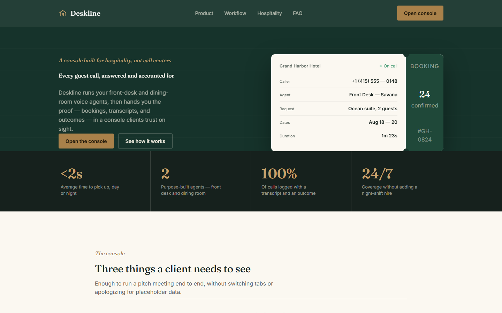
</p>
<p align="center"><em>Landing page — hospitality-focused value proposition and product preview</em></p>

<br/>

| Preview | Screen |
|:-------:|--------|
| 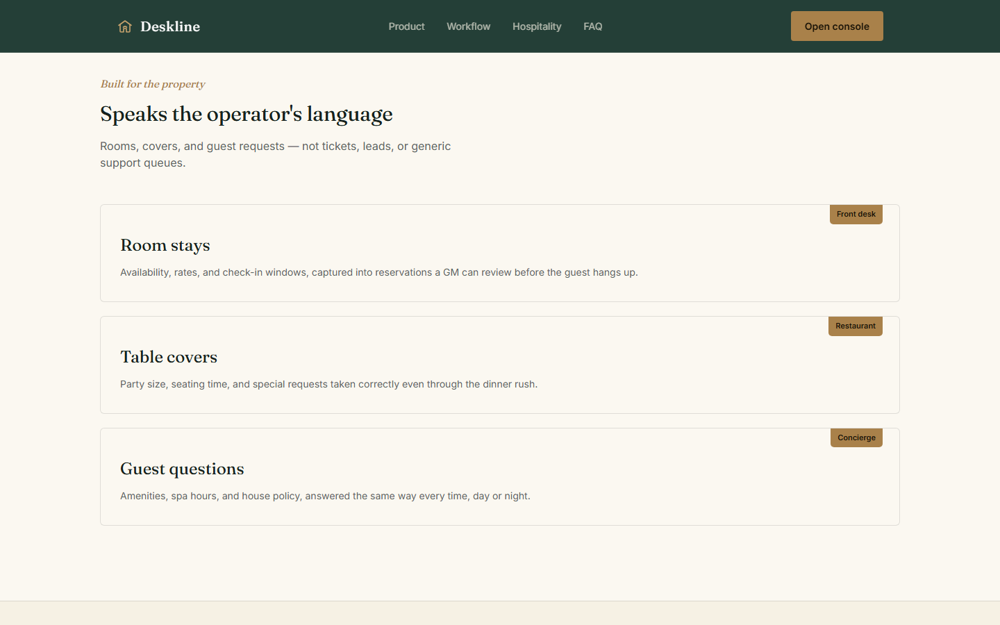 | **Platform features**<br/>Inbound handling, room & table booking, campaigns, knowledge base, live monitor, and analytics. |
| 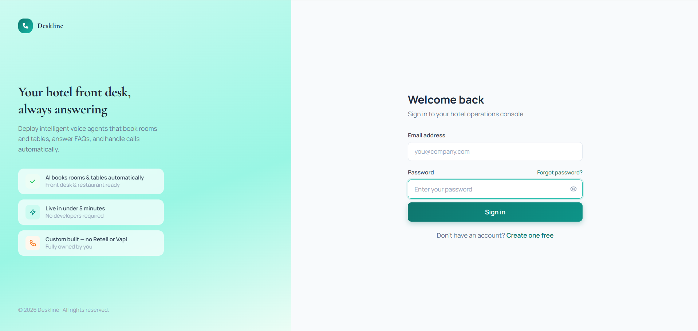 | **Secure login**<br/>Hotel operations console sign-in with clear product positioning. |
| 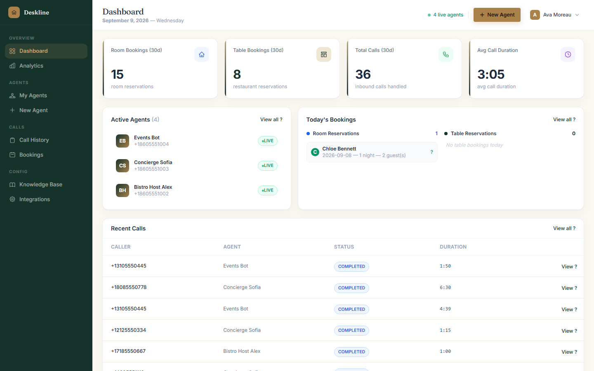 | **Operations dashboard**<br/>30-day KPIs, active agents, today’s room/table bookings, and recent calls. |
| 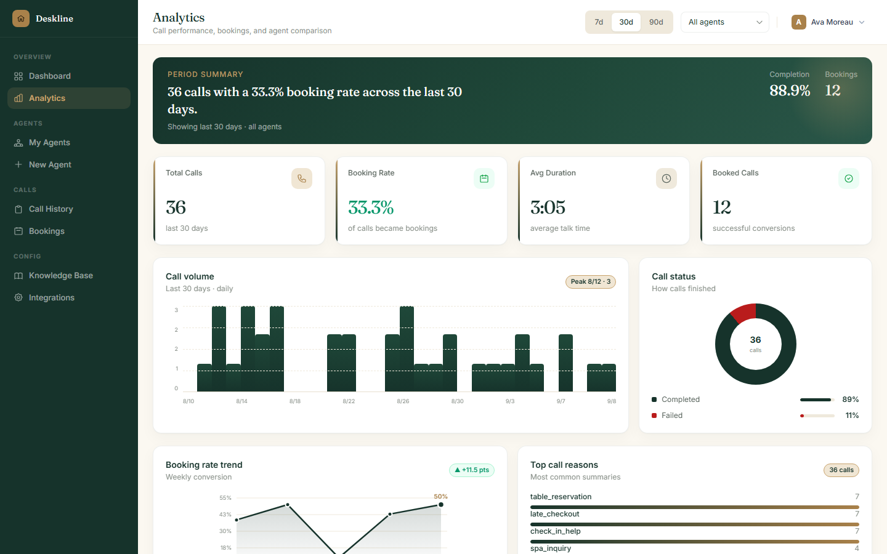 | **Analytics**<br/>Call volume, outcome breakdown, booking rate, and performance trends. |
| 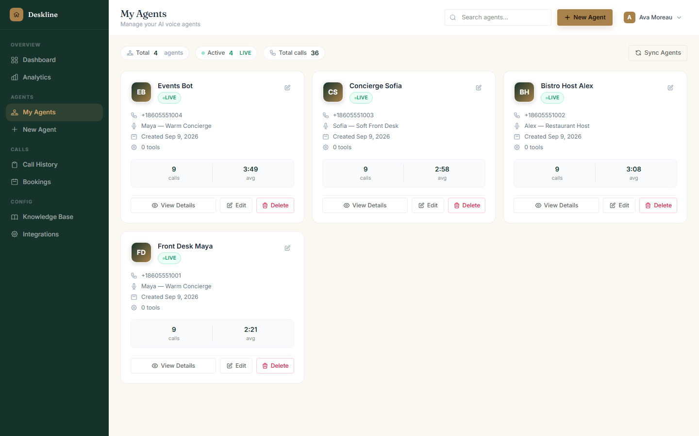 | **My Agents**<br/>Manage live, paused, and draft voice agents with tools and phone numbers. |
| 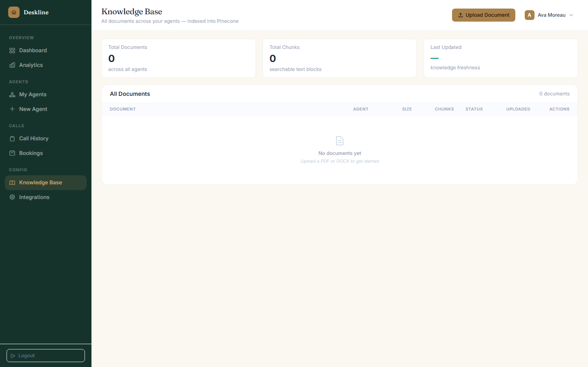 | **My Tools**<br/>Built-in booking and availability tools agents can invoke during calls. |
| 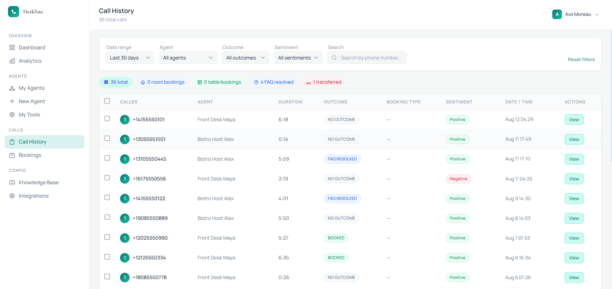 | **Call history**<br/>Filterable logs with outcome, sentiment, duration, and agent attribution. |
| 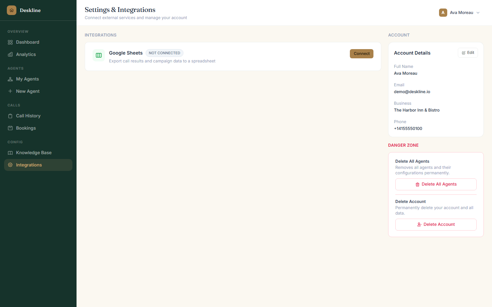 | **Settings & integrations**<br/>External connectors (e.g. Google Sheets) and account management. |

### Screenshot index

| File | Description |
|------|-------------|
| `screenshots/01-landing-page.png` | Marketing landing / hero |
| `screenshots/02-platform-features.png` | Feature grid |
| `screenshots/03-login.png` | Authentication |
| `screenshots/04-operations-dashboard.png` | Main dashboard |
| `screenshots/05-analytics.png` | Performance analytics |
| `screenshots/06-my-agents.png` | Agent management |
| `screenshots/07-my-tools.png` | Tool library |
| `screenshots/08-call-history.png` | Call logs |
| `screenshots/09-integrations.png` | Integrations & account |

---

## Architecture

### System overview

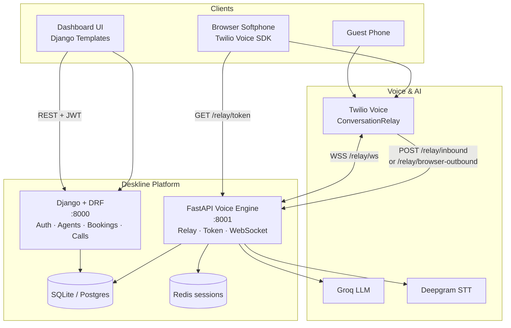

### Call flow (browser or phone)

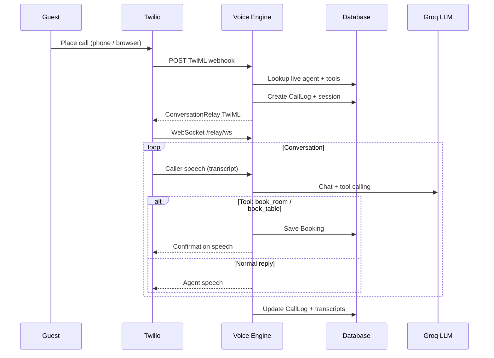

### Data model (core)

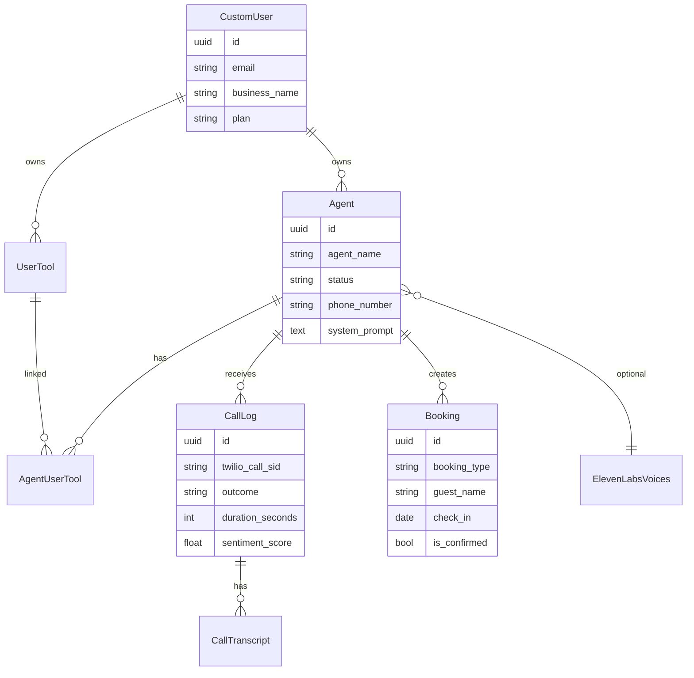

---

## Tech stack

| Layer | Technology |
|--------|------------|
| Web / API | Django 4.2, Django REST Framework, SimpleJWT |
| Voice runtime | Retell (external) — Twilio FastAPI stack removed |
| UI | Django templates, Tailwind CSS (local build) |
| Data | SQLite (local) / Postgres (optional) |
| Jobs | Celery (optional; eager mode for local) |

---

## Project structure

```
ai-voice-agent-platform/
├── accounts/          # Auth, profile, seed_demo command
├── agents/            # Agents, tools, bookings
├── calls/             # Call logs, transcripts, analytics
├── dashboard/         # Stats & booking panels
├── knowledge/         # Documents / RAG hooks
├── integrations/      # Third-party connectors
├── templates/         # Deskline UI
├── static/            # CSS / frontend assets
├── manage.py
└── requirements.txt
```

---

## Quick start

### 1. Setup

```bash
python -m venv .venv

# Windows
.\.venv\Scripts\activate

# macOS / Linux
source .venv/bin/activate

pip install -r requirements.txt
cp .env.example .env
```

Ensure in `.env`:

```env
USE_SQLITE=True
DATABASE_URL=sqlite:///db.sqlite3
DJANGO_BASE_URL=http://localhost:8000
CELERY_TASK_ALWAYS_EAGER=True
```

### 2. Database + demo data

```bash
python manage.py migrate
python manage.py seed_demo
npm install
npm run build:css
```

**Demo login**

| Field | Value |
|--------|--------|
| Email | `demo@deskline.io` |
| Password | `demo1234` |

### 3. Run

```bash
python manage.py runserver
```

Open **http://127.0.0.1:8000** → Log in → Dashboard.

Live voice calls are handled outside this app (e.g. Retell). Django stores agents, tools, bookings, and call/ops data.

---

## Voice runtime note

The previous Twilio ConversationRelay + FastAPI (`voice_engine`) stack was removed.
Use Retell (or another voice provider) for agents; keep Deskline for storing agent fields and business data.

---

## Demo data (for screenshots)

```bash
python manage.py seed_demo --flush
```

Seeds Harbor Inn demo profile, agents, tools, calls, and bookings used in the gallery above.

Login: `demo@deskline.io` / `demo1234`

---

## API map (high level)

| Area | Base path |
|------|-----------|
| Auth | `/api/auth/` |
| Agents & tools | `/api/agents/` |
| Calls & analytics | `/api/calls/` |
| Dashboard | `/api/dashboard/` |

---

## Tooling for agents

Attach tools in **My Tools**, then link them on the agent. Runtime names:

| Tool | Purpose |
|------|---------|
| `book_room` | Hotel room reservation |
| `book_table` | Restaurant table reservation |
| `check_availability` | Slot check (demo) |

LLM receives OpenAI-style function schemas from `UserTool.parameters`.

---

## Environment variables

See `.env.example` for the full list. Minimum for UI-only screenshots:

- `SECRET_KEY`, `USE_SQLITE=True`
- `DJANGO_BASE_URL`

Live voice: configure Retell separately; Deskline stores agent and ops fields.

---

## License

Private portfolio project — all rights reserved unless otherwise stated.
