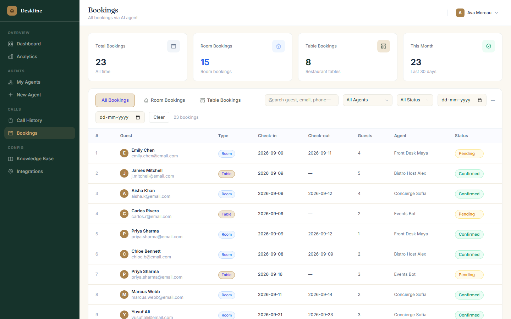
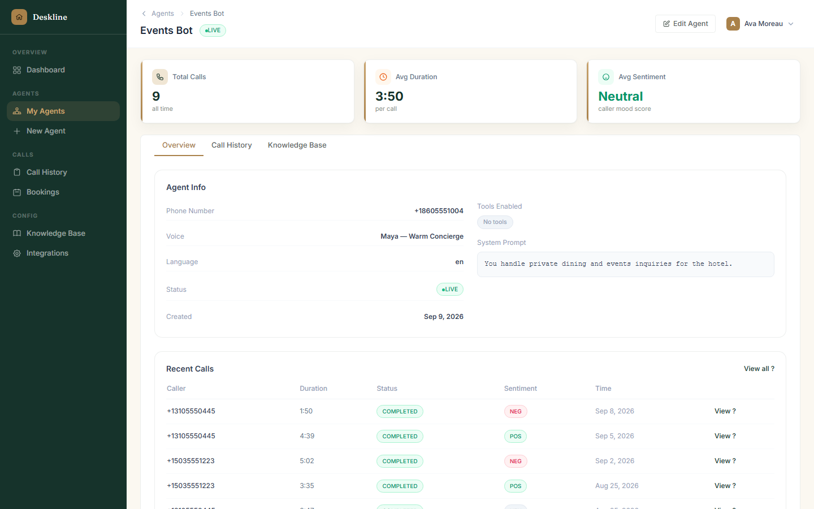
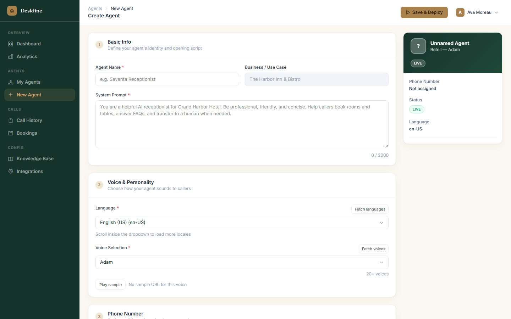
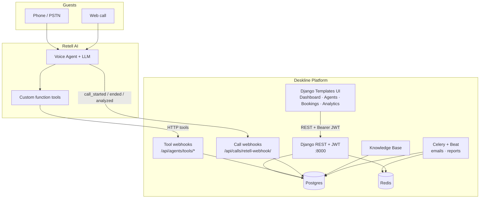
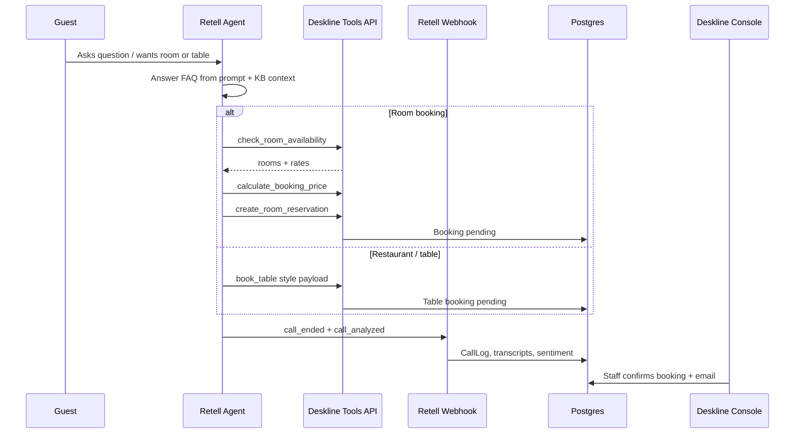
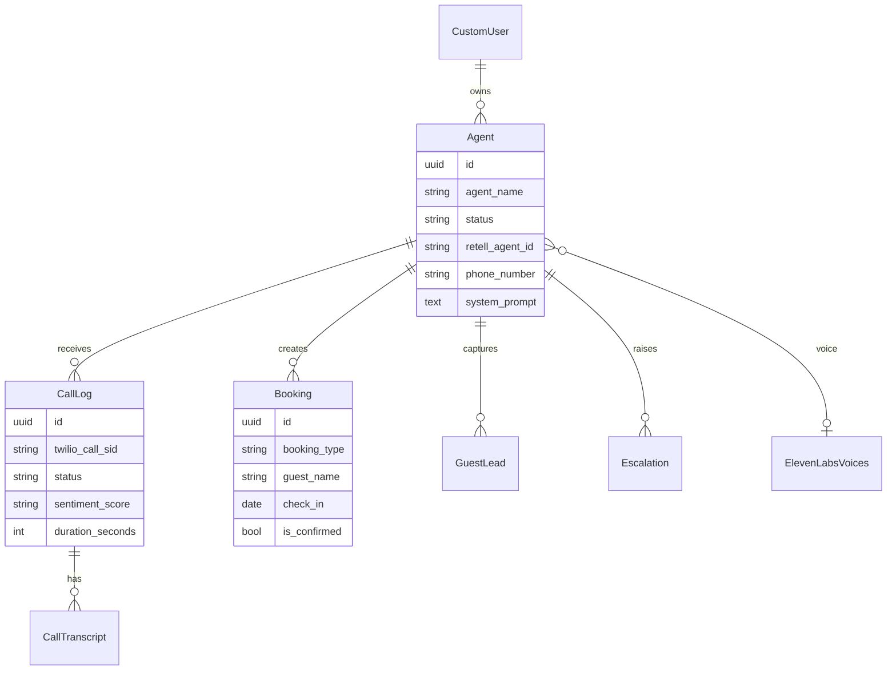
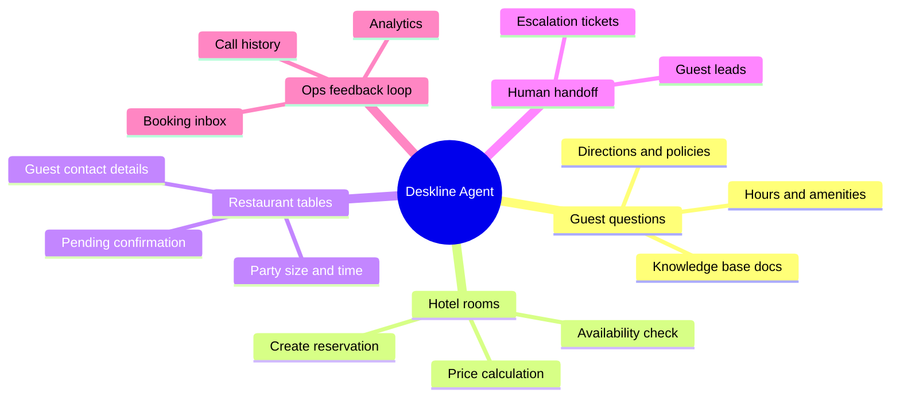

# Deskline — AI Voice Agents for Hospitality

<p align="center">
  
</p>

<p align="center">
  <b>Deskline</b> is a full-stack operations console for hospitality voice agents.<br/>
  Create Retell-powered agents that answer guest questions, book hotel rooms,<br/>
  reserve restaurant tables, escalate to staff, and sync everything into one dashboard.
</p>

<p align="center">
  
  
  
  
  
</p>

---

## Table of contents

- [What Deskline does](#what-deskline-does)
- [Screenshots](#screenshots)
- [Architecture](#architecture)
- [Agent capabilities](#agent-capabilities)
- [Tech stack](#tech-stack)
- [Project structure](#project-structure)
- [Quick start (local)](#quick-start-local)
- [Docker deploy](#docker-deploy)
- [Environment variables](#environment-variables)
- [API map](#api-map)
- [Demo data](#demo-data)
- [License](#license)

---

## What Deskline does

| Area | Capability |
|------|------------|
| **Voice agents** | Create, sync, and manage Retell agents (voice, language, phone, prompt, tools) |
| **Guest Q&A** | Answer general property questions via system prompt + knowledge base docs |
| **Room booking** | Check availability, price nights, create room reservations |
| **Restaurant booking** | Capture table reservations (party size, date/time, guest details) |
| **Leads & escalation** | Save guest leads; escalate when AI cannot resolve |
| **Ops console** | Dashboard KPIs, bookings inbox, call history, analytics, integrations |

Built as a **portfolio / production-shaped** Django product: JWT APIs, Retell webhooks, Celery jobs, and a polished hospitality UI.

---

## Screenshots

Fresh captures of the current Deskline UI (forest / parchment console).

<p align="center">
  
</p>
<p align="center"><em>Landing — hospitality-focused product story</em></p>

<br/>

| Preview | Screen |
|:-------:|--------|
|  | **Built for the property**<br/>Room stays, table covers, and guest questions |
|  | **Login**<br/>JWT console auth for hotel / restaurant operators |
|  | **Dashboard**<br/>30-day KPIs, live agents, today’s bookings, recent calls |
|  | **Analytics**<br/>Volume, status mix, booking rate trend, agent comparison |
|  | **My Agents**<br/>Status, call counts, avg duration, Retell sync |
|  | **Knowledge Base**<br/>Property docs that power guest Q&A |
|  | **Call history**<br/>Filters, sentiment, transcripts, detail drawer |
|  | **Integrations**<br/>Connectors + account settings |
|  | **Bookings**<br/>Room & restaurant reservations, pending → confirm |
|  | **Agent detail**<br/>KPIs, tools, recent calls for one agent |
|  | **Create agent**<br/>Voice, language, phone, prompt, deploy |

### Regenerate screenshots

With the server running and demo data seeded:

```bash
python manage.py seed_demo
python scripts/capture_screenshots.py
python scripts/recapture_shots.py   # optional polish shots
```

---

## Architecture

### System overview (Lucid-style)



### Call + booking sequence



### Data model (core)



### Capability map



---

## Agent capabilities

Agents are not booking-only bots. A typical front-desk / restaurant agent can:

1. **Answer general guest questions** — check-in times, Wi‑Fi, parking, spa, restaurant hours, house rules (system prompt + knowledge documents).
2. **Book hotel rooms** — `check_room_availability` → `calculate_booking_price` → `create_room_reservation` (saved as **Pending** until staff confirms).
3. **Book restaurant tables** — capture guest name, party size, date/time, contact; stored as `booking_type=table`.
4. **Escalate** — when the request is too complex, create an escalation / lead for humans.
5. **Feed the console** — every call lands in Call History; outcomes power Analytics and Dashboard KPIs.

| Tool endpoint | Purpose |
|---------------|---------|
| `POST /api/agents/tools/check-room-availability/` | Room inventory for dates / guests |
| `POST /api/agents/tools/calculate-booking-price/` | Nightly rate + tax estimate |
| `POST /api/agents/tools/create-room-reservation/` | Persist room booking (pending) |
| `POST /api/calls/retell-webhook/` | Call lifecycle events from Retell |

---

## Tech stack

| Layer | Technology |
|--------|------------|
| Web / API | Django 4.2, Django REST Framework, SimpleJWT |
| Voice runtime | **Retell AI** (agents, phones, LLM, tools) |
| UI | Django templates, Tailwind CSS, Deskline design system |
| Data | Postgres (Docker) / SQLite (local demos) |
| Jobs | Celery + Redis + django-celery-beat |
| Deploy | Docker, Gunicorn, WhiteNoise |

---

## Project structure

```
ai-voice-agent-platform/
├── accounts/           # Auth, profile, seed_demo
├── agents/             # Agents, Retell sync, tools, bookings
├── calls/              # Call logs, transcripts, analytics, webhooks
├── dashboard/          # Stats + bookings API
├── knowledge/          # Documents for guest Q&A
├── integrations/       # Connectors + scheduled reports
├── monitoring/         # Analytics page render
├── templates/          # Deskline console UI
├── static/             # CSS / JS assets
├── screenshots/        # README gallery images
├── docker/
│   └── entrypoint.sh
├── Dockerfile
├── docker-compose.yml
├── manage.py
└── requirements.txt
```

---

## Quick start (local)

### 1. Python env

```bash
python -m venv .venv

# Windows
.\.venv\Scripts\activate

# macOS / Linux
source .venv/bin/activate

pip install -r requirements.txt
cp .env.example .env
```

Suggested local `.env` values:

```env
USE_SQLITE=True
DEBUG=True
CELERY_TASK_ALWAYS_EAGER=True
DJANGO_BASE_URL=http://localhost:8000
retell_api_key=your_retell_key
```

### 2. Migrate + demo + CSS

```bash
python manage.py migrate
python manage.py seed_demo
npm install
npm run build:css
python manage.py runserver
```

Open **http://127.0.0.1:8000**

| Demo login | Value |
|------------|--------|
| Email | `demo@deskline.io` |
| Password | `demo1234` |

---

## Docker deploy

### Prerequisites

- Docker Desktop / Engine
- Docker Compose v2
- A filled `.env` (copy from `.env.example`)

### One-command stack

```bash
cp .env.example .env
# Edit SECRET_KEY, DB_*, retell_api_key, EMAIL_*, DEBUG=False

docker compose up --build -d
```

Services started:

| Service | Role | Port |
|---------|------|------|
| `web` | Gunicorn Django app | **8000** |
| `db` | Postgres 16 | 5432 |
| `redis` | Broker / cache | 6379 |
| `celery` | Background worker | — |
| `celery-beat` | Scheduled tasks | — |

App URL: **http://localhost:8000**

### Useful commands

```bash
# Logs
docker compose logs -f web

# Shell
docker compose exec web python manage.py shell

# Seed demo inside container
docker compose exec web python manage.py seed_demo

# Rebuild after code changes
docker compose up --build -d

# Stop
docker compose down
```

### Production notes

1. Set a strong `SECRET_KEY` and `DEBUG=False`.
2. Put the app behind HTTPS (nginx / Caddy / cloud load balancer).
3. Point Retell **tool URLs** and **call webhooks** to your public domain:
   - Tools: `https://YOUR_DOMAIN/api/agents/tools/...`
   - Calls: `https://YOUR_DOMAIN/api/calls/retell-webhook/`
4. Persist volumes `deskline_pg`, `deskline_media`, `deskline_static`.

### Dockerfile-only (single container)

For a quick image without Compose (use SQLite or external Postgres):

```bash
docker build -t deskline:latest .
docker run --env-file .env -p 8000:8000 deskline:latest
```

When using SQLite in the container, set `USE_SQLITE=True` in `.env`.

---

## Environment variables

| Variable | Purpose |
|----------|---------|
| `SECRET_KEY` | Django secret |
| `DEBUG` | `True` local / `False` prod |
| `ALLOWED_HOSTS` | Host allow-list |
| `USE_SQLITE` | `True` for local SQLite |
| `DB_NAME` `DB_USER` `DB_PASSWORD` `DB_HOST` `DB_PORT` | Postgres |
| `REDIS_URL` | Cache + Celery broker |
| `CELERY_TASK_ALWAYS_EAGER` | Inline tasks (local) |
| `DJANGO_BASE_URL` | Public base URL for links / webhooks |
| `retell_api_key` | Retell API key (used by `agents/retell_services.py`) |
| `EMAIL_HOST_USER` / `EMAIL_HOST_PASSWORD` | Booking confirmation email |
| `ELEVENLABS_API_KEY` | Optional voice catalog |

See `.env.example` for the full template.

---

## API map

| Area | Base path |
|------|-----------|
| Auth | `/api/auth/` |
| Agents + Retell sync + tools | `/api/agents/` |
| Calls, analytics, Retell webhook | `/api/calls/` |
| Dashboard + bookings | `/api/dashboard/` |
| Knowledge | `/api/knowledge/` |
| Integrations | `/api/integrations/` |

Standard success envelope:

```json
{ "success": true, "message": "...", "data": { } }
```

---

## Demo data

```bash
python manage.py seed_demo --flush
# or in Docker:
docker compose exec web python manage.py seed_demo --flush
```

Seeds Harbor Inn style demo profile, agents, calls, and bookings for screenshots.

Login: `demo@deskline.io` / `demo1234`

---

## License

Private portfolio project — all rights reserved unless otherwise stated.

---

<p align="center">
  Built with care for hospitality ops · Deskline
</p>
